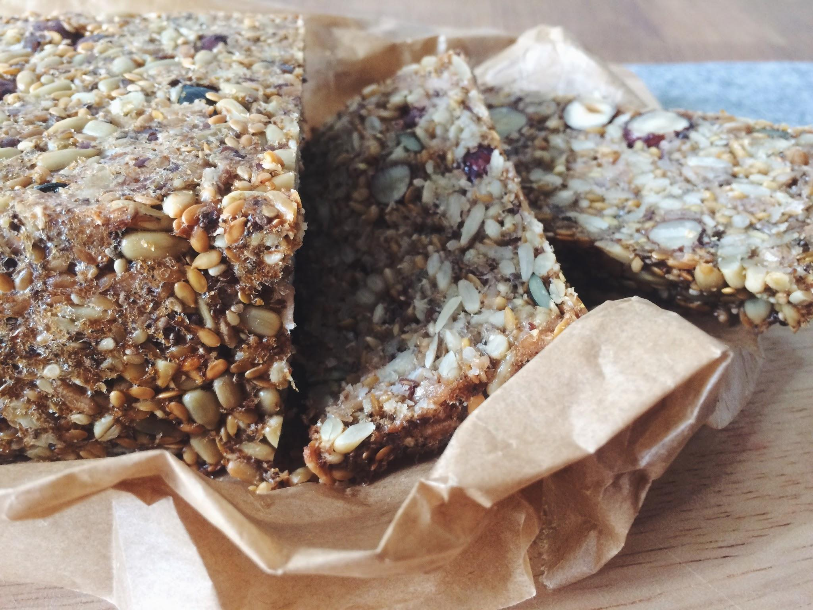
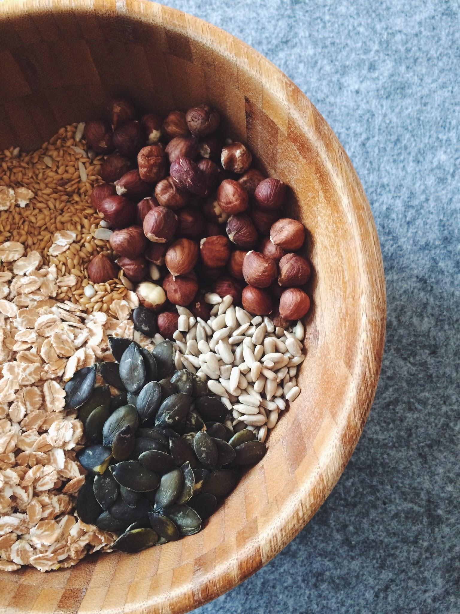
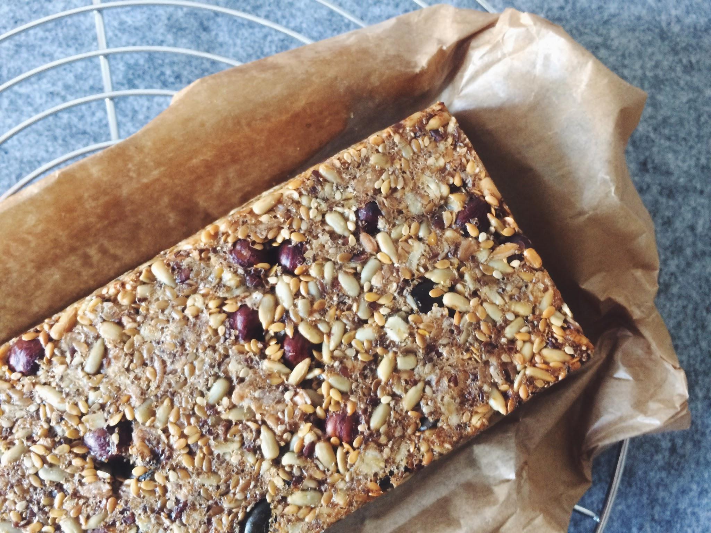

Wer mich kennt weiß, bei Brot kann es mir nicht kernig genug sein. Auch das letzte abgefallene Körnchen wird beim Frühstück vom Teller aufgepickt und wieder fein säuberlich auf dem Brot oder Brötchen platziert. Besonders knusprig geröstet kann ich kaum genug von den kleinen aber feinen Knusperkernen bekommen. Egal ob Sonnenblumenkerne, Sesam. Leinsamen oder Kürbiskerne, alles einfach nur lecker! Es gab also kein langes Zögern, als mir das Rezept für Saatenbrot in die Hände fiel. 

Der erste Versuch endete noch recht bröselig. Da nicht nur das Verhältnis von trockenen zu feuchten Zutaten stimmen muss sondern auch von nicht-quellenden zu quellenden, benötigte es einige Zeit und mehrere Experimente, bis ich zu einer Rezeptur gelangte, die mich voll und ganz zufrieden stellte. Aber dieses Rezept kannst Du natürlich noch ganz nach Deinem Geschmack abwandeln, achte nur darauf, dass das Grundverhältnis von trocken und feucht, quellend und nicht-quellend bestehen bleibt, sonst kann es sein, dass Dir beim Stürzen aus der Form nur ein Häufchen bröseliger Körner bleibt.

Hast Du es dann geschafft und ein perfekt gebräuntes, knuspriges und kerniges Saatenbrot aus dem Ofen geholt, bleibt kein Wunsch offen. Frisch schmeckt es – wie das bei Brot nunmal so ist – natürlich am allerbesten. Aber lass es gut abkühlen, bevor Du es anschneidest, warm ist es noch recht instabil. 

Da man selten ein ganzes Brot auf einmal verputzt, kannst Du das Saatenbrot auch problemlos ein paar Tage aufbewahren. Ich wickle es dafür lose in ein Stück Backpapier und bewahre es in meinem Brottopf (bester Kauf meines Lebens!) auf. Da hält es sich gut und gerne 5–7 Tage. Willst Du auf Nummer sicher gehen, kannst Du es auch gut verpackt im Kühlschrank lagern. Und wenn es nach ein paar Tagen etwas mehr Pepp vertragen kann, röste die Scheiben einfach im Toaster, das gibt Ihnen den ultimativen Geschmack. Und jetzt, lass es Dir schmecken!

**Für eine Kastenform (Länge: 25 cm)**

140 g Sonnenblumenkerne

90 g Leinsamen

50 g Haselnüsse

100 g Haferflocken (glutenfrei, bei Bedarf)

40 g Kürbiskerne

30 g Sesam

2 EL Chiasamen

6 EL Flohsamenschalen

1 TL Salz

3 EL Kokosöl

350 ml warmes Wasser

*Zubereitung*

1. Die trockenen Zutaten gründlich miteinander vermischen, so dass quellende und nicht-quellende Kerne und Körner gut vermengt sind.

2. Das Kokosöl in einer großen Schüssel im warmen Wasser auflösen und beides gut verrühren. Die trockenen Zutaten mit einem Teigschaber gründlich unter das Wasser-Öl-Gemisch rühren und alles gründlich miteinander verkneten.

3. Die Kastenform mit Kokosöl einfetten und die Mischung hineingeben. Die Masse mit dem Teigschaber fest in die Form drücken und die Oberfläche glattstreichen. Sollte die Masse zu klebrig sein, hilft es die Hände oder den Spatel mit kaltem Wasser anzufeuchten.

4. Das Saatenbrot für mindestens 2 Stunden, besser über Nacht, ruhen lassen.

5. Den Ofen auf 175°C (Ober-/Unterhitze) vorheizen und das Brot im heißen Ofen für 25–30 Minuten backen. Anschließend das Brot aus dem Ofen nehmen, aus der Form lösen, auf ein mit Backpapier ausgelegtes Backblech stürzen und im Ofen erneut für 30–40 Minuten backen. Das Brot sollte hohl klingen, wenn man draufklopft.

6. Das Saatenbrot aus dem Ofen nehmen und auf einem Gitter gut auskühlen lassen.

Wie bereits erwähnt hält sich das Brot mehrere Tage, im Kühlschrank auch gut eine Woche. Wenn Du nur selten Brot isst, kannst Du das Saatenbrot in Scheiben geschnitten einfrieren. Es genügt dass, es nach Bedarf aus dem Gefrierfach zu nehmen und im Toaster aufzutauen.

