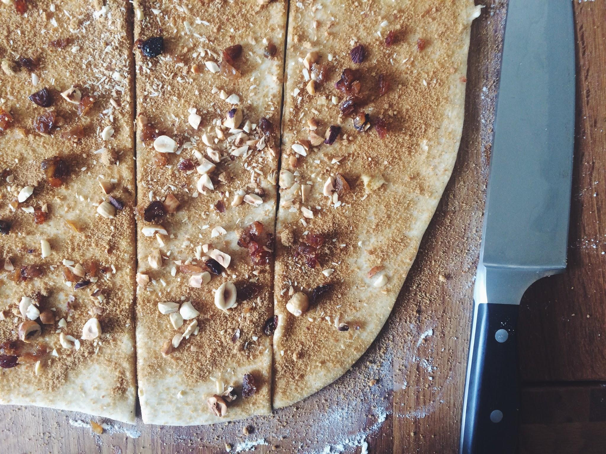
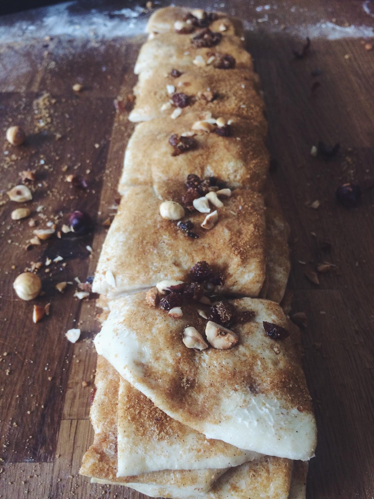
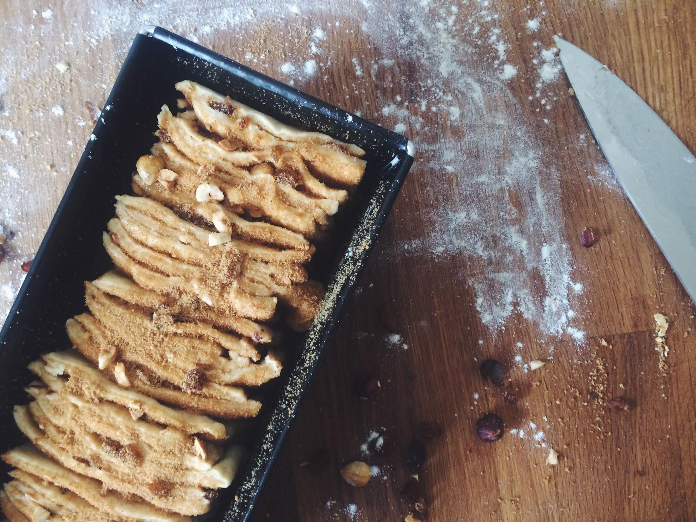

Es gibt Tage, die schreien förmlich nach Soulfood! Die ganze Woche war es eiskalt, windig und man wollte eigentlich nicht mal den kleinen Zeh vor die Tür halten. Als nun auch das Wochenende keinerlei Anstalten machte sich diesbezüglich zu bessern, stand Sonntagmorgen bereits im Bett fest: Heute gibt es was mit Hefe! 

Zum Hintergrund: Für mich ist Hefegebäck gleichbedeutend mit Gemütlichkeit, Genuss und Entspannung. Vielleicht, weil es bei meiner Oma immer den leckersten Hefekuchen mit Streuseln gab und ich schon damals so gerne mit meinen Händen den weichen Teig knetete. Vielleicht, weil man Hefegebäck – wider besseren Wissens ob der drohenden Bauchschmerzen – nie abkühlen lassen kann, bevor man das erste Stück nascht und sich danach mit vollem Bauch und warmem Tee so herrlich aufs Sofa kuscheln kann. Ich weiß es nicht. Aber eines steht fest: Wenn draußen Regen, Wind und Hagel toben, gibt es drinnen warmes und duftendes Hefegebäck, das ist Gesetz! 

Neben Rosinenbrötchen und Zimtschnecken gefüllt mit Pumpkin Butter hat sich mittlerweile auch diese Zupfbrotvariation in mein Herz geschlichen. Nicht nur weil sie so herrlich fluffig und zart ist und auf der Zunge zu zergehen scheint, sondern auch, weil man zupft und zupft und niemals eine trockene Stelle erwischt. Jede Scheibe ist von Butter, Zucker und Zimt umgeben und immer wieder beißt man auf eine knackige Haselnuss oder eine süße Rosine, die den Geschmack vervollkommnen. 

Du siehst schon, ich könnte ewig so weiter schwärmen, aber ich stecke mir mal lieber noch eine Scheibe dieses Hefetraums in den Mund so lange er noch lauwarm ist und genieße im Stillen weiter, denn sind wir mal ehrlich, dieser Geschmack ist eigentlich unbeschreiblich! 

**Für eine Kastenform (Länge: 25 cm)**

*Hefeteig*

160 g Milch

20 g frische Hefe

350 g Mehl (Type 550)

50 g Butter

30 g Zucker

1 Ei

½ TL Salz

*Füllung*

50 g weiche Butter

50 g braunen Zucker

1 TL Zimt

50 g Haselnüsse

50 g Rosinen

1 Ei

4 EL Milch

*Zubereitung *

1. Die Milch in einem Topf erwärmen bis sie handwarm ist. Die Hefe in eine kleine Schale bröseln und in einem Teil der warmen Milch auflösen. Passt auf, dass die Milch hier nicht heißer als handwarm ist, da die Hefekulturen sonst zerstört werden. Eine gute Prise des Zuckers zur Hefe geben, um sie anzufüttern.

2. Das Mehl in eine große Schüssel geben und in der Mitte eine Mulde formen. Den Zucker und das Salz außen herum streuen. Die Hefe-Milch-Mischung in die Mulde geben und warten, bis die Hefe beginnt zu wachsen und kleine Bläschen zu bilden. Inzwischen die restliche warme Milch mit Butter und Ei mischen und bereitstellen. 

Mehl und Hefe vorsichtig miteinander vermischen, Milch, Butter und Ei unterrühren. Alles zu einem Teig verkneten, zunächst in der Schüssel, danach auf der bemehlten Arbeitsfläche. Ich weiß, das ist am Anfang immer eine kleine bis mittelgroße Schweinerei und viele nutzen aus diesem Grund lieber eine Rührmaschine, für mich kommt bei Hefeteig aber nur eines in Frage: mit beiden Händen mittenrein und fühlen, wie der Teig nach und nach eine unglaublich weiche und geschmeidige Konsistenz bekommt. Das dauert bis zu 10 Minuten, aber das lange Kneten lohnt sich, also haltet durch!

3. Den Teig zu einer Kugel formen und in die (saubere) Schüssel legen. Leicht mit Mehl bestäuben und mit Klarsichtfolie oder Bee`s Wrap luftdicht verschlossen an einem warmen Ort für 30–40 Minuten gehen lassen, bis sich sein Volumen verdoppelt hat. 

Während der Teig geht, die Haselnüsse im Ofen bei 180°C (Ober-/Unterhitze) auf einem Blech rösten, bis sie anfangen zu duften und ihre Schale beginnt sich zu lösen. Die Nüsse aus dem Ofen holen und abkühlen lassen. Nach dem Abkühlen die Nüsse zwischen den Händen reiben, so dass sich die Schalen lösen. Die geschälten Nüsse und die Rosinen auf einem Brett grob hacken.

5. Den aufgegangenen Teig aus der Schüssel nehmen und noch einmal gründlich durchkneten. Zu einer Kugel formen und 5 Minuten auf der Arbeitsfläche liegen lassen. Das dient der Entspannung des Teiges, der sich anschließend besser ausrollen lässt.

Den Teig mit einem Wellholz zu einem ca. 30x50 cm großen Rechteck ausrollen und mit der weichen Butter großzügig bis zum Rand (!) bestreichen. Zucker und Zimt in einer Schüssel mischen und bis auf ca. 2 EL gleichmäßig auf dem gesamten Teig verteilen. Ebenso mit Nüssen und Rosinen verfahren und alles gut andrücken.

6. Den Teig entlang der kürzeren Seite in 6 gleichgroße Streifen schneiden und diese vorsichtig aufeinander legen. Anschließend den langen Stapel quer in 6 ca. gleichgroße Rechtecke schneiden und diese hintereinander in die Kastenform schichten. Den Teig mit den übrigen 2 EL Zimt und Zucker bestreuen und mit einem Handtuch abgedeckt erneut ca. 30–40 Minuten an einem warmen Ort gehen lassen, bis er die Kastenform gut ausfüllt.

7. Inzwischen den Ofen auf 170–180°C (Ober-/Unterhitze) vorheizen. Das Ei mit der Milch verquirlen und das aufgegangene Zupfbrot großzügig damit bestreichen.

Nun wandert das Zupfbrot für 35–40 Minuten in den heißen Ofen, bis es die Holzstäbchenprobe besteht und eine knusprig-karamellige Kruste gebildet hat. Anschließend könnt Ihr es aus dem Ofen holen und zunächst in der Form, später auf einem Gitter abkühlen lassen.

Frisch schmeckt Hefegebäck natürlich immer am allerbesten, aber solltet Ihr kein ganzes Zupfbrot auf einmal schaffen – glaubt mir, das ist zu zweit locker zu schaffen – hält sich das Brot auch mindestens 3 Tage ohne trocken zu werden. Wer es besonders süß mag, kann das Zupfbrot auch noch mit einem Guss aus Puderzucker, Wasser und Zimt bestreichen, ein wahrer Hochgenuss!

